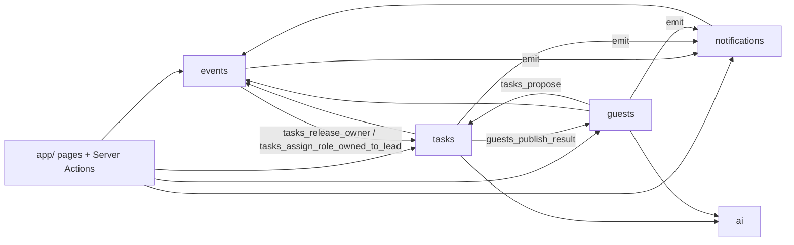
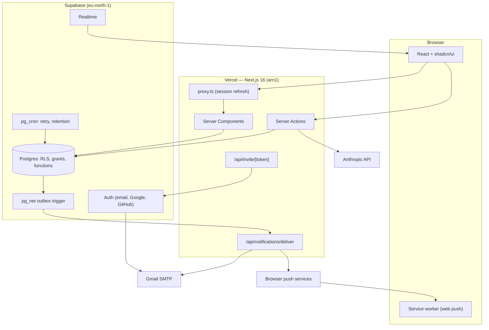
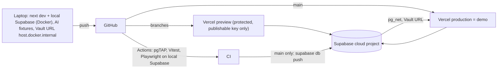
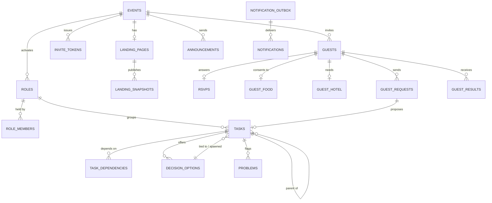

# Architecture Spine — Arrangly

## Design Paradigm

**Modular monolith.** One Next.js 16 App Router app on Vercel, one Supabase Postgres database. Five modules own their tables. **The database is the security boundary.** Every request path, including direct calls to Supabase's REST API (PostgREST), is limited by Row Level Security (RLS), column-level grants and SQL functions. Server Actions add input validation and UX on top of that. Changes that span several rows go through one SQL function. Side effects leave the database through a transactional outbox.

| Module | Owns (tables) | Lives in |
| --- | --- | --- |
| **events** (Event & Team) | events, roles, role_members, invite_tokens, event_guest_stats | `src/modules/events` |
| **tasks** | tasks, task_dependencies, decision_options, problems, status_history | `src/modules/tasks` |
| **guests** | guests, rsvps, guest_food, guest_hotel, guest_requests, guest_results, landing_pages, landing_snapshots | `src/modules/guests` |
| **notifications** | notification_outbox, notifications, announcements, announcement_groups, announcement_group_members, volunteer_offers, channel_prefs, push_subscriptions | `src/modules/notifications` |
| **ai** (AI gateway) | ai_usage | `src/modules/ai` |



Arrows mean "may read from, or call the named function of". A labelled arrow allows only that function. The ai module calls no other module.

## Invariants & Rules

### AD-1 — Module ownership of data [ADOPTED]

- **Binds:** all
- **Prevents:** two modules each writing the same table with different rules.
- **Rule:** Only the owning module (table above) writes to its tables. Another module that needs a change calls the owner's SQL function, and only along an arrow in the module graph. Reading across modules is allowed under RLS.

### AD-2 — Two mutation paths [ADOPTED]

- **Binds:** all writes
- **Prevents:** half-applied multi-step changes, and the same rule implemented once in TS and once in SQL.
- **Rule:**
  - **Direct edits** are allowed only on columns granted per AD-19, from a Server Action under the user's session. For example: a Task title or description, the text of an RSVP answer, or a Landing page draft.
  - **Everything else is one Postgres function** called from a Server Action, which either commits fully or not at all. That includes all of these:
    - `tasks_set_status` (writes `status_history` and may publish a guest result)
    - `tasks_delegate`, `tasks_accept`, `tasks_resolve_decision`, `tasks_propose`, `tasks_confirm_proposed`
    - `guests_submit_rsvp`, `guests_submit_request`, `guests_reply_request`
    - `guests_publish_landing`, `guests_delete_guest_data`
    - `events_set_role_lead`, `events_revoke_role`
  - `tasks_resolve_decision` locks the Decision Task (`FOR UPDATE`). Only the decision's named recipient or the Organizer may resolve it. Follow-up Tasks record `spawned_by_option_id` and are obsoleted or re-activated like option-tied Tasks when a decision is reversed (FR-11).

### AD-3 — RLS policy model [ADOPTED]

- **Binds:** FR-2, FR-3, FR-15–FR-19, §4.9, SM-2
- **Prevents:** access enforced in only some paths, guests unable to read their own data, revoked holders keeping access.
- **Rule:**
  - **Which tables:** every table has RLS enabled.
  - **Allowed policy inputs:** exactly `events.organizer_id`, `role_members`, `tasks.owner_user_id` and `guests.user_id`. Policies never match on email.
  - **Shared helpers:** every policy uses `is_organizer(event_id)`, `holds_role(role_id)`, `is_guest_of(event_id)` and `is_guest_self(guest_id)`.
  - **Who sees a Task:** `is_organizer OR holds_role(task.role_id) OR owner_user_id = auth.uid()`.
  - **What a Guest sees:** only their own rows, plus the latest published `landing_snapshots` of their Event.
  - **Who sees guest data:**
    - `guest_food` and `guest_hotel` are readable only by the Organizer, the Guest themselves and holders of the owning Role (guest-data ownership convention).
    - Holders of other Roles see the Guest count only, never names or emails.
  - **Views:** all views are `WITH (security_invoker = true)`.
  - **UI:** hiding a field in the interface is never the protection.

### AD-4 — One identity model, one invite system [ADOPTED]

- **Binds:** FR-1, FR-3, FR-5, FR-18
- **Prevents:** a token model that bypasses RLS, competing invite mechanisms, and a forwarded email that logs someone into a full account.
- **Rule:**
  - **One table for all invites:** `invite_tokens` (owned by events) with `kind ∈ {guest, role_holder, shared_event}`. Tokens are 256-bit random values, stored as SHA-256 and compared in constant time. They are valid until `events.ends_at` and can be revoked.
  - **One exchange route:** `app/api/invite/[token]` handles every kind.
    - **guest:** issues a Supabase session only if the user is guest-only. Guest-only means no password, no OAuth identity, no `role_members` row, and organizes no Event. Anyone else is sent to sign-in with the email prefilled.
    - **role_holder:** goes to account creation with the name and email prefilled.
    - **shared_event:** shows a name and email form. It creates a `guests` row with `identified=false` and emails a personal guest token. No session exists until that link is opened.
  - **Invitees are users:** every invitee becomes a passwordless Supabase Auth user when invited.
  - **Revocation:** adding a password or an identity, or being added to a Role, revokes that user's guest tokens in the same transaction.
  - **Fresh links:** a fresh link can always be requested by email. The response is identical whether or not the email exists.
  - **Never Supabase magic links:** Supabase's own magic links (valid at most one day) are never used as invite links.

### AD-5 — Elevated privilege is confined

- **Binds:** all server code, all SQL functions
- **Prevents:** bypassing RLS outside the few places that need it (SM-2).
- **Rule:**
  - **Secret key, in TS:** the Supabase secret key (`sb_secret_…`, which replaces the legacy service_role key) is used only in these places:
    - the invite exchange route
    - invitee user creation
    - the notification delivery route
    - deleting an auth user on *Delete my data*
  - **Secret key, never:** it is never imported into a client component.
  - **Client key:** clients use `NEXT_PUBLIC_SUPABASE_PUBLISHABLE_KEY`.
  - **`security definer` functions** are allowed only for these:
    - `notifications_emit`
    - `ai_reserve`
    - `guests_delete_guest_data` and its purge hooks
    - the retention job
    - token exchange
  - **Rules for every definer function:**
    - it sets `search_path = ''`
    - it is `REVOKE EXECUTE … FROM public, anon, authenticated`, so it can be called only from other SQL functions or the server, never through PostgREST
    - it has a pgTAP test

### AD-6 — Sign-in providers [ADOPTED]

- **Binds:** FR-1, FR-3
- **Prevents:** provider-specific account logic, and promising account linking that Supabase doesn't do.
- **Rule:**
  - **Providers:** email and password, Google, and GitHub, all through Supabase Auth. No others in v1.
  - **Account linking:**
    - Signing in with Google or GitHub automatically links to an existing user with the same email, if the provider reports that email as verified.
    - Adding a password uses `updateUser` while signed in.
    - Connecting Google or GitHub from settings uses `linkIdentity`, with manual linking enabled in `supabase/config.toml` and in the cloud project.
  - **What the UI shows:** never derive the user's providers from `raw_app_meta_data` (Supabase auth bug #2472).
  - **Test:** a Playwright test covers upgrading a Guest to an account with Google.

### AD-7 — Notifications through a transactional outbox [ADOPTED]

- **Binds:** FR-16, FR-17, FR-21, FR-23, all notification producers
- **Prevents:** lost, forged or duplicate notifications, and producers that disagree on who the recipients are.
- **Rule:**
  - **Only writer:** `notifications_emit(event_id, kind, subject_ref, recipients recipient_spec[])` is the only thing that writes to notifications tables. It is a definer function (AD-5). `authenticated` has no INSERT, UPDATE or DELETE on notifications tables.
  - **Recipients:** `recipient_spec` is one of:
    - `user(id)`, `role(id)`, `role_lead(id)`
    - `organizer(event)`
    - `team(event)`, meaning the Organizer plus all Role members, deduplicated
    - `group(id)`, `guest(guest_id)`
    - `data_owner(event, field)`, which applies the guest-data ownership convention, including the Organizer fallback

    The sender is excluded. Recipients are expanded at send time into `notifications` rows. The announcement feed is read only from the recipient's own rows, as a snapshot, never from live membership.
  - **One per recipient per action:**
    - Rows are unique on `(txid, recipient_id)`.
    - A second `emit` in the same transaction for the same recipient is merged into the existing row (`kinds[]`, rendered as "2 new items need you").
    - Notifications from different actions are not grouped, and nothing is delayed.
  - **Payloads:** they hold IDs and an i18n key only, never names or health data. Names are resolved when the notification is read.
  - **Announcements:** sending one requires a confirmation dialog.

### AD-8 — Delivery and live updates [ADOPTED]

- **Binds:** FR-17, FR-19, FR-21, FR-23
- **Prevents:** double sends, unauthenticated delivery, environment-specific URLs in migrations, and Realtime used everywhere.
- **Rule:**
  - **The trigger:** a trigger on `notification_outbox` (created in a migration) calls `net.http_post` with `timeout_milliseconds = 5000` to `/api/notifications/deliver`. It reads the URL and a `DELIVERY_SECRET` from Supabase Vault, which is seeded separately per environment and never hard-coded.
  - **Authentication:** the route rejects any request without `Authorization: Bearer <DELIVERY_SECRET>` before doing anything else.
  - **Claiming:** the route first claims the row:

    ```sql
    UPDATE … SET claimed_until = now() + '2 min', attempts = attempts + 1
    WHERE id = $1 AND (claimed_until IS NULL OR claimed_until < now())
    RETURNING *
    ```

    If no row comes back, it exits.
  - **Per-channel tracking:** each channel records its own `email_sent_at` and `push_sent_at`, and a retry sends only the channels still missing.
  - **Push:** web push uses `web-push` with VAPID and our own service worker. A 404 or 410 from a push endpoint deletes that subscription.
  - **Retries:** a pg_cron job re-posts rows whose claim has expired and that still have unsent channels, up to 5 attempts, then marks them failed.
  - **Pacing:** email is drained at most 20 per minute and 400 per day. Rows over the cap stay queued and are shown to the Organizer as "x queued".
  - **Realtime:** the publication contains only `notifications` and `announcements`, using `postgres_changes` under RLS. The Needs-you list re-fetches its server query when a `notifications` insert arrives for the viewer. Every other view refreshes on navigation.

### AD-9 — AI gateway is the only path to a model [ADOPTED]

- **Binds:** FR-6, FR-13 (Target), FR-14, FR-16, FR-22
- **Prevents:** unbounded spend, cap races, unauthorized use of the Organizer's quota, nondeterministic tests, and health data sent to a third party.
- **Rule:** Only `src/modules/ai` imports `@anthropic-ai/sdk`. Each call names a feature key.

  | Feature key | Model | Cap (UTC days) | Who may call | When unavailable |
  | --- | --- | --- | --- | --- |
  | `task-list` | `claude-sonnet-5` | 3 per Event | Organizer | Organizer adds Tasks manually |
  | `status-note` | `claude-haiku-4-5` | 20 per Event per day | Task owner | No proposal shown |
  | `draft-email` | `claude-sonnet-5` | 20 per user per day | Task owner | Empty draft prefilled with Event facts |
  | `route-request` | `claude-haiku-4-5` | 1 per request | system, after `guests_submit_request` | Stays with the Organizer |
  | `landing-about:draft` / `:rewrite` | `claude-sonnet-5` | 1 / 5 per Event | Organizer | Empty editor with a short note |

  - **Reserving:** before a call, `ai_reserve(feature, event_id)` checks that the caller is authorized and atomically inserts a reservation if it is under the cap. It is a definer function and is not exposed through PostgREST. A failed or unavailable call removes its reservation.
  - **Monthly ceiling:** USD 5 a month. The worst-case cost (`max_tokens` × price) is reserved before the call and settled to the actual tokens afterwards.
  - **Never an error page:** hitting a cap returns `unavailable`, and each feature falls back as listed above.
  - **Timeouts:** Server Actions that call AI export `maxDuration = 60` and treat a timeout as `unavailable`.
  - **Fixtures:** fixture mode (recorded responses in `supabase/fixtures/ai`) is the default unless `NODE_ENV === 'production'` and `AI_LIVE=1`, and it is always used in tests and previews.
  - **No health data:** allergy, food and hotel data are never part of a prompt.

### AD-10 — All email is an outbox row [ADOPTED]

- **Binds:** FR-1, FR-3, FR-5, FR-17, FR-23
- **Prevents:** Server Actions sending 80 emails in one request, and several email senders with different setups.
- **Rule:**
  - **One path:** every application email (invites, reminders, notifications) is an outbox row (AD-7), sent by the delivery route through `src/modules/notifications/email` using nodemailer over SMTP.
  - **Exception:** Supabase Auth's own emails (confirmations, password resets) are the only ones that don't go through the outbox.
  - **Provider is configuration only.** For v1 it is a personal Gmail account with an app password. Gmail also serves as Supabase Auth's custom SMTP, with the Auth email rate limit raised from 30 per hour as an environment setup step.
  - **Switching provider:** moving to Resend with our own domain changes environment variables, not code.

### AD-11 — GDPR baseline [ADOPTED]

- **Binds:** FR-15, FR-16, FR-18, §4.9 (supersedes its "formal handling out of scope")
- **Prevents:** health data handled without consent, kept indefinitely, sent to third parties, or surviving deletion through copies in other modules.
- **Rule:**
  - **Region:** Supabase runs in `eu-north-1` and Vercel functions in `arn1`, both in Stockholm, set in `vercel.json`. `proxy.ts` only refreshes the auth cookie and never reads personal data.
  - **Consent:** `guest_food` rows require `consent_at` (CHECK constraint).
  - **Deletion:** `guests_delete_guest_data(guest_id)` calls each owner's purge hook in one transaction:
    - `tasks_purge_guest` clears `source_guest_request_id` and replaces the guest's name in Task text with "a guest"
    - `notifications_purge_user_event`
    - `ai_purge_user`
  - **Foreign keys:** every foreign key to `guests`, `guest_requests` or `auth.users` declares `ON DELETE SET NULL` or `CASCADE`. A pgTAP test asserts there is no `NO ACTION`.
  - **The auth user:** it is deleted only if the person is guest-only (AD-4) and is a guest of no other Event.
  - **Automatic retention:** a pg_cron job runs this deletion for every Guest 15 days after `events.ends_at`. Anonymised counts are first written to `event_guest_stats`. The job is idempotent and catches up after the project has been paused.
  - **Delete my data:** this action on the Guest Dashboard runs the same function for one Guest.
  - **Privacy notice:** a static page lists the processors: Supabase, Vercel, Anthropic and Google.

### AD-12 — Landing page publishes a snapshot

- **Binds:** FR-22
- **Prevents:** Guests seeing drafts.
- **Rule:**
  - **Editing:** the Organizer edits `landing_pages`.
  - **Publishing:** `guests_publish_landing` copies the page into an immutable `landing_snapshots` row and builds the Program section from Tasks with *show on guest program* switched on, using only their guest label and time of day.
  - **Guest access:** Guests can read only the latest snapshot (AD-3).

### AD-13 — Timeline is computed, never stored

- **Binds:** FR-20, FR-7, FR-11
- **Prevents:** a stored order drifting away from the Task graph.
- **Rule:** One TS function computes the Timeline on the server for each request. It sorts each Role lane topologically, breaks ties by deadline and nests Subtasks under their parent. No table stores Timeline order.

### AD-14 — Localisation without locale URLs

- **Binds:** §4.9, FR-4, FR-22
- **Prevents:** invite or landing links that change with language, and hard-coded strings.
- **Rule:**
  - **Library:** next-intl without i18n routing.
  - **UI language:** comes from the user's setting, otherwise the browser, otherwise `en`.
  - **Strings:** all UI text lives in `messages/nb.json` and `messages/en.json`.
  - **Guest-facing text:** AI text and emails to Guests use `events.language`.

### AD-15 — Schema evolves only through migrations

- **Binds:** all
- **Prevents:** a cloud database that differs from the repository, and types that differ from the schema.
- **Rule:**
  - **Every change is a migration:** schema, policies, grants, functions, cron jobs and triggers are SQL files in `supabase/migrations`.
  - **Cloud deploys:** migrations reach the cloud only from `main`, through CI running `supabase db push`.
  - **Types:** `supabase gen types` regenerates `src/types/database.ts` after every migration.
  - **No dashboard changes:** nothing is changed in the Supabase dashboard except Vault secrets and the Auth rate limit.
  - **Demo data:** one `supabase/seed.sql` owns the flagship 40th-birthday scenario.

### AD-16 — Test ownership by layer [ADOPTED]

- **Binds:** SM-1, SM-2, AD-3, AD-11, AD-19
- **Prevents:** gaps where each layer assumes another one tests it.
- **Rule:**
  - **pgTAP (`supabase test db`):** covers every RLS policy, grant and SQL function, proving one allowed case and one denied case. That includes a denied direct PostgREST write.
  - **Vitest:** covers branching TS logic, such as AI reservation and settling, the Timeline sort and email pacing.
  - **Playwright:** covers UJ-1, UJ-2, UJ-3 and the AD-6 upgrade with Google, with AI in fixture mode.
  - **CI:** all three run in GitHub Actions on every push against local Supabase in Docker, never against the cloud.

### AD-17 — Validate at the action boundary

- **Binds:** all Server Actions and route handlers
- **Prevents:** malformed input reaching SQL functions or prompts.
- **Rule:** Every Server Action and route handler parses its input with a Zod schema before anything else. Zod handles UX validation. AD-19 is the security boundary.

### AD-18 — Proposed Tasks, ownership and guest results

- **Binds:** FR-6, FR-7, FR-9, FR-12, FR-16, FR-18
- **Prevents:** two shapes for Proposed Tasks, two models of Task ownership, and Task completion that never reaches the Guest.
- **Rule:**
  - **Where Proposed Tasks live:** they are rows in `tasks` with `lifecycle ∈ {proposed, active, dismissed}`, kept separate from `status`.
  - **Where they come from:** `source ∈ {ai_description, questionnaire_gap, status_note, guest_need, guest_request}`, with an optional `source_guest_request_id`.
  - **Who creates them:** only `tasks_propose` creates them. Other modules call it.
  - **Ownership:** every Task has a required `role_id` and an optional `owner_user_id`. If `owner_user_id` is NULL, the Task is Role-owned, which is "pending" in FR-12.
  - **Setting a Role lead:** `events_set_role_lead` calls `tasks_assign_role_owned_to_lead(role_id)`, which assigns every pending active Task in that Role to the lead and sends one notification.
  - **Revoking a Role:** `events_revoke_role` calls `tasks_release_owner(role_id, user_id)`, which returns those Tasks to the Role and resets acceptance.
  - **Guest requests:** `guests_submit_request` commits the request together with its Proposed Task, routed to the Organizer. `route-request` (AD-9) runs afterwards and can only re-route it.
  - **Guest results:** `tasks_set_status(done)` on a Task with `source_guest_request_id` calls `guests_publish_result`, which writes to `guest_results` (owned by guests).
  - **Replies:** `guest_requests` allows one reply, enforced by a unique constraint.

### AD-19 — The database is the boundary

- **Binds:** all tables, SM-2
- **Prevents:** a logged-in user calling PostgREST directly to change columns that only a function may change, such as `owner_id`, `accepted_at`, `obsolete`, consent, or a reply.
- **Rule:**
  - **Grants:**
    - `authenticated` gets `SELECT` as RLS allows.
    - It gets `UPDATE (col, …)` only on the direct-edit columns listed per table in the migration.
    - All other INSERT, UPDATE and DELETE is revoked and happens only through AD-2 functions.
  - **Invariants as constraints:** every invariant that a direct call could break is a database constraint or trigger. For example:
    - one lead per Role (partial unique index)
    - dependencies and parents in the same Role (trigger)
    - consent required for food data (CHECK)
    - deactivating a Role is a flag (`roles.active = false`), never a delete

### AD-20 — Environment isolation

- **Binds:** environments, secrets
- **Prevents:** public preview URLs holding production secrets, and preview code sending real email or making live AI calls.
- **Rule:**
  - **Protection:** Vercel previews have Deployment Protection on.
  - **What previews get:** only the publishable key, never the secret key, `ANTHROPIC_API_KEY`, SMTP credentials or `DELIVERY_SECRET`.
  - **What that means:** AI runs in fixture mode, and delivery happens only from production.
  - **Accepted risk:** previews share the demo database, so data created in a preview is real demo data.
  - **Upgrade path:** a separate staging project.

### AD-21 — Abuse limits on public endpoints

- **Binds:** invite exchange, fresh-link request, shared-event signup, guest requests, account creation
- **Prevents:** a script using up Gmail's daily cap, guessing tokens, or creating users in bulk.
- **Rule:** Public routes are rate-limited with a Postgres-backed counter, with no new vendor:
  - 5 per minute per IP
  - 3 per hour per email or token
  - 10 guest requests per Guest per day

## Consistency Conventions

| Concern | Convention |
| --- | --- |
| Naming | Tables and columns use `snake_case`, and tables are plural. SQL functions are `module_verb_noun`. TS files use `kebab-case` and components use `PascalCase`. PRD §3 Glossary terms are used verbatim in code. |
| IDs and time | Keys are `uuid`, generated by `gen_random_uuid()`. Timestamps are `timestamptz` in UTC. `events.starts_at`, `events.ends_at`, `events.time_zone` and `events.language` are required. A deadline is a `date` in the Event's time zone and becomes overdue after 23:59:59 local time. "N days before the event" is stored resolved and recalculated when `starts_at` changes. The guest-program time is a local time in the Event's time zone. |
| Task state | Stored fields: `lifecycle`, and `status ∈ {not_started, in_progress, waiting_external, done}`, plus `accepted_at`, `obsolete` and an open Problem. `blocked`, `overdue` and `stale_unaccepted` (not accepted within 48 h, FR-9) are derived in a `security_invoker` view and never stored. |
| Guest-data ownership | Allergies and food belong to Food & Beverage. Hotel belongs to Travel & Logistics. RSVP and requests belong to Guests. If that Role is inactive, the Organizer owns them. Used by AD-3, AD-7 (`data_owner`) and AD-18 routing. |
| Server auth | `proxy.ts` refreshes the session only (`@supabase/ssr`). Server code checks the user with `auth.getClaims()` and never trusts `getSession()`. |
| Errors | Server Actions return `{ ok: true, data } \| { ok: false, error: { code, message } }`, where `message` is a next-intl key. They never throw to the client. |
| Config and secrets | Environment variables are validated with Zod at startup. Client: `NEXT_PUBLIC_SUPABASE_URL`, `NEXT_PUBLIC_SUPABASE_PUBLISHABLE_KEY`, `NEXT_PUBLIC_VAPID_PUBLIC_KEY`. Server (production only, AD-20): `SUPABASE_SECRET_KEY`, `ANTHROPIC_API_KEY`, `SMTP_*`, `VAPID_PRIVATE_KEY`, `DELIVERY_SECRET`, `AI_LIVE`. CI: `SUPABASE_ACCESS_TOKEN`, `SUPABASE_DB_PASSWORD`, `SUPABASE_PROJECT_ID`. Vault: deliver URL and `DELIVERY_SECRET`. |
| Logging | Server logs carry event id and user id. They never contain names, health data or prompt bodies. |

## Stack

Versions checked with `npm view` and against vendor docs on 2026-10-02 (`reviews/review-tech-currency.md`).

| Name | Version |
| --- | --- |
| Next.js (App Router, `proxy.ts`) | 16.3.x |
| React | 19.x |
| TypeScript | 5.9.x (`create-next-app` 16.3 default; TS 7 deferred until lint tooling supports it) |
| Tailwind CSS | 4.3.x |
| shadcn/ui + Lucide | latest via shadcn CLI at scaffold |
| @supabase/supabase-js | 2.117.x |
| @supabase/ssr | 0.12.x |
| Supabase CLI | 2.119.x |
| Postgres extensions | pg_cron, pg_net, pgTAP, Vault (Supabase-provided) |
| next-intl | 4.14.x |
| zod | 4.6.x |
| @anthropic-ai/sdk | 0.131.x |
| nodemailer | 10.0.x |
| web-push (+ @types/web-push) | 3.6.7 (last release 2024, protocol-stable; swap if it breaks) |
| Vitest | 5.0.x |
| @playwright/test | 1.63.x |
| Hosting | Vercel Hobby `arn1`; Supabase Free `eu-north-1` |

## Structural Seed

### System view



### Environments



Operations: the free plan pauses after 7 idle days, so open the demo the day before grading. There is no point-in-time recovery on the free plan, so take a weekly `pg_dump` as a private artifact.

### Core entities



### Source tree

```text
arrangly/
  app/                    # (team)/, (guest)/, privacy/, api/notifications/deliver, api/invite/[token]
  proxy.ts                # @supabase/ssr session refresh only
  src/modules/
    events/  tasks/  guests/  notifications/  ai/   # actions.ts, queries.ts, schemas.ts per module
  src/types/database.ts   # generated (AD-15)
  messages/               # nb.json, en.json (AD-14)
  public/sw.js            # push service worker
  supabase/
    config.toml           # manual identity linking, auth rate limits (local)
    migrations/           # schema, RLS, grants, functions, triggers, cron
    tests/                # pgTAP
    fixtures/ai/          # recorded AI responses (AD-9)
    seed.sql              # flagship scenario
  e2e/                    # Playwright
  vercel.json             # regions: ["arn1"]
```

## Capability → Architecture Map

| Capability | Lives in | Governed by |
| --- | --- | --- |
| FR-1 accounts, FR-3 guest identity | events, `api/invite` | AD-4, AD-5, AD-6, AD-21 |
| FR-2 Roles + RBAC | events | AD-3, AD-18, AD-19 |
| FR-4 questionnaire, FR-5 guest list | events, guests | AD-2, AD-4, AD-10, AD-14 |
| FR-6 AI task list, status-note proposals | tasks → ai | AD-9, AD-18 |
| FR-7–FR-9, FR-12 Tasks, status, accept, delegation | tasks | AD-2, AD-18, AD-19, Task state |
| FR-10/11 decisions, obsolete-marking | tasks | AD-2, AD-16 |
| FR-13 venue options (Target AI search) | tasks (→ ai in Target) | AD-9 |
| FR-14 drafted email | tasks → ai | AD-9 |
| FR-15–FR-18 RSVP, needs, reminders, Guest Dashboard | guests | AD-2, AD-3, AD-7, AD-10, AD-11, AD-18 |
| FR-19 Dashboard | tasks, guests (reads) | AD-3, AD-8 |
| FR-20 Timeline | tasks | AD-13 |
| FR-21 announcements, volunteers | notifications | AD-7, AD-8 |
| FR-22 Landing page, Run of Show | guests → ai | AD-12, AD-9, AD-14 |
| FR-23 channels | notifications | AD-7, AD-8, AD-10 |
| §4.9 privacy, localisation, cost | cross-cutting | AD-11, AD-14, AD-9 |
| SM-2 RBAC holds | supabase/tests | AD-3, AD-16, AD-19 |

## Deferred

- **Exact columns and indexes** beyond what the ADs name. Each module's first story fixes them in migrations.
- **Package manager.** No divergence risk once a lockfile exists.
- **Component breakdown and page layout.** Governed by UX DESIGN.md and EXPERIENCE.md.
- **Staging Supabase project.** This is AD-20's upgrade path.
- **Email provider switch** (Resend with our own domain). A config change under AD-10.
- **Realtime via private Broadcast.** Only needed if Free-plan Realtime limits are reached.
- **Target features** (bulk import, AI venue search, richer Timeline, Role-holder reminders). Each falls under the modules and ADs above.
- **Full GDPR compliance** (records of processing, DPAs, DPIA, consent log). See `docs/refleksjonsnotater.md`.
- **Observability beyond Vercel and Supabase logs.** Not needed at demo scale.
